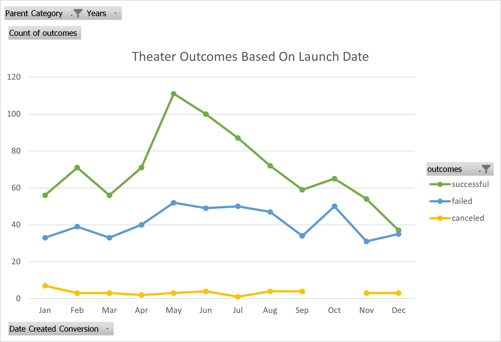
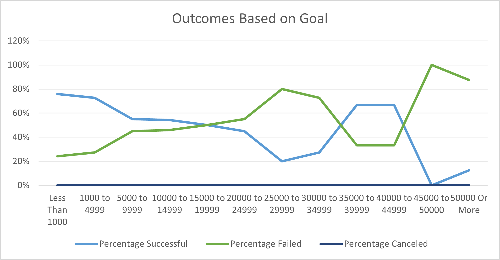

# Kickstarter Analysis for Louise

## Overview of Project

### Purpose

The purpose of this project is to examine the impact of Kickstarter project launch months and fundraising goals on project outcomes. Hopefully, this analysis will help Louise make optimal decisions to ensure that her play *Fever* is successful.

## Analysis and Challenges

### Analysis of Outcomes Based on Launch Date

Successful theater projects peak in May at around 110 successful projects, then decline gradually for the remainder of the year, hitting their low in December of below 40, before picking up in January and February and decreasing in March. During the decline from May to December, there is a slight increase in October, possibly indicating a slight uptick during the Halloween holiday. Theater projects are most successful in the summer months of May through August, with a sharp increase in May after April. The number of failed and canceled plays stagnate throughout the year.

### Analysis of Outcomes Based on Goals

No plays were canceled. Plays are most likely to be successful (80%) with lower fundraising goals, under 5000. Plays with higher fundraising goals are less likely to be successful despite an increase in the 35000 to 39999 range. However, the population size of plays with fundraising goals over 20000 is relatively low, so it is problematic to draw inferences based on trends in higher fundraising goals. Nonetheless, lower fundraising goals are associated with a relatively high success rate.

### Challenges and Difficulties Encountered

Low population size of plays with high fdundraising goals means that it is more difficult to assess the true success rate of plays with fundraising goals over 20000. However, this limitation can be overcome by assuming that most Kickstarter promoters have some information that leads them to believe that high-goal projects are unlikely to succeed. It is unlikely that the distribution of fundraising goals is caused by random chance because a set of uniformly random choices of fundraising goals would approximate a normal distribution by the Central Limit Theorem.

## Results

- Most theater projects are successful in the summer months of May through August. Failures and cancelations stagnate throughout the year, so therefore the probability of success is greatest in May through August.

- Plays with fundraising goals under 5000 are significantly more likely to be successful than other plays. Promoters are significantly less likely to attempt projects with goals over 20000.

- There is no clear data dividing theater projects by genre or subgenre, so it is difficult to determine if the genre of play impacts success or failure. Blurbs are not always sufficient to determine the genre or subgenre of a theater project. Additionally, the data only shows average donations and we do not know if the distribution of donations is skewed for a project, such as when a rich person fully funds a project.

- Some other graphs include Outcomes Based on Launch Year, Outcomes Based on Average Donation, and Average Percent Funded by Goal Range.
