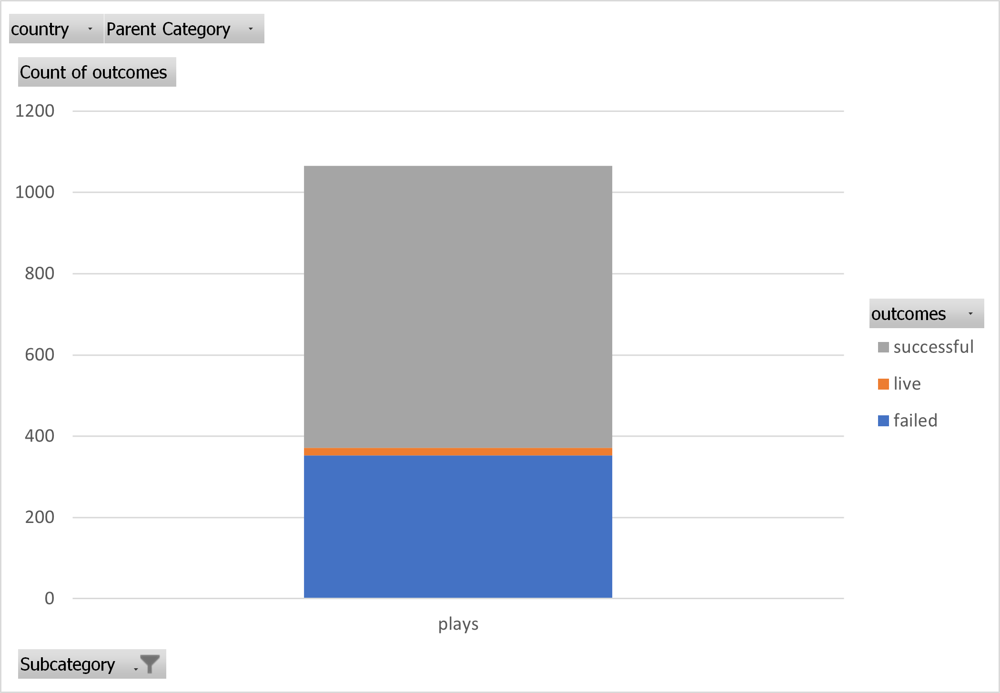
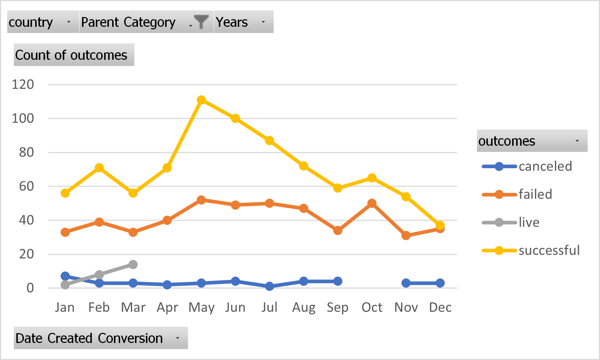
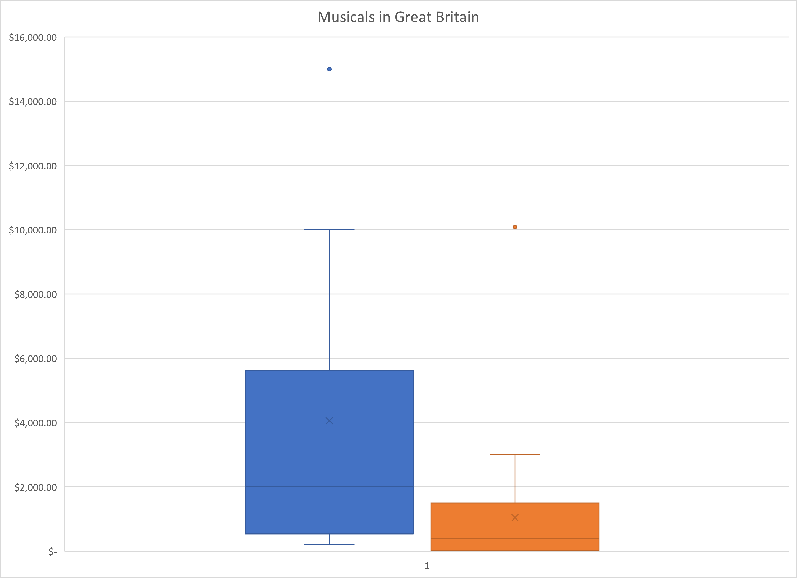

# Kickstarter Campaign Analysis
Performing analysis on Kickstarter data to uncover trends

## Objective

Analyze trends in Kickstarter data using descriptive statistics.

## Findings

- The lower 25% of musicals in Great Britain got no funding.
- Failed projects have higher funding goals.
- No successful fiction or art books.

## Plots

### Subcategory Statistics

### Outcomes Based on Launch Date

### Musicals in Great Britain

